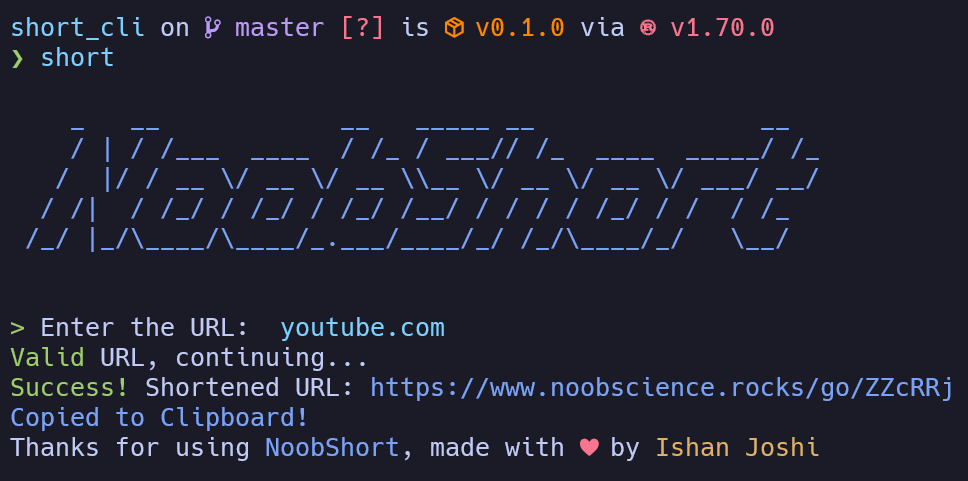

# NoobShort CLI

NoobShort is a simple to use URL shortener. It is just a small part of
my site [noobscience.rocks](https://noobscience.rocks).
I made a very pretty web interface for it, but I also wanted to make a CLI
version of it. So here it is.

You can check out the web interface at [noobscience/go](https://noobscience.rocks/go).

## Screen shot



## Installation

NoobShort CLI is very easy to install. Just clone the repo and run
`cargo build --release`. Then, copy the binary from `target/release/short_cli`
to wherever you want it to be. I recommend `/usr/local/bin/short`, so that
you can just type `short <url>` from anywhere. Just copy paste the following

```bash
git clone https://github.com/newtoallofthis123/short_cli/
cd short_cli
cargo build --release
sudo cp target/release/short_cli /usr/local/bin/short
```

However, if you are not a rustecean, you can download the binary from
the [releases](https://github.com/newtoallofthis123/short_cli/releases)
page. Just download the binary for your OS and architecture and put it
somewhere in your PATH.

> I need your help. I don't have a Mac, so I can't compile the binary for
Mac. If you have a Mac, please compile the binary and send it to me.
Thanks!

## Usage

NoobShort CLI is very easy to use. Just type `short <url>` and it will
return the shortened URL. If you want to use a custom URL, type
`short <url> --custom <custom>`. If the custom URL is already taken, it will
return an error.

It is very simple and easy to use. I hope you enjoy it.

Just a small thing though, I am sorry if the interface has too much
branding. I am not trying to advertise, I just want to make sure that
people know where the URL is coming from. I hope you understand.

## Dev Stuff

NoobShort CLI is written primarily in Rust 1.7.0. It uses multiple
dependencies, which are listed in the Cargo.toml file.

It posts a request to the publicly available API at
`https://noobscience.rocks/api/go`. The API is written in TypeScript and
uses MongoDB as a database.
It is publicly available and you are free to integrate it into your own
projects. Just make sure to give me credit and keep in mind the [Terms of Service](https://noobscience.rocks/tos).

If you want to contribute, feel free to fork the repo and make a pull
request. I will review it and merge it if it is good.

To have this locally, you need to have Rust >= 1.4.0 and Cargo >= 0.6.0.
Then, just clone the repo and run `cargo build --release`. The binary will
be in `target/release/short_cli`.

To develop, open it in your favorite editor and start coding. To run it,
just run `cargo run` and it will compile and run it for you.

## License

NoobShort CLI is licensed under the MIT license. You can find it in the
[LICENSE](LICENSE) file.

## Contact

If you have any questions, feel free to contact me at
[noobscience/contact](https://noobscience.rocks/contact).
